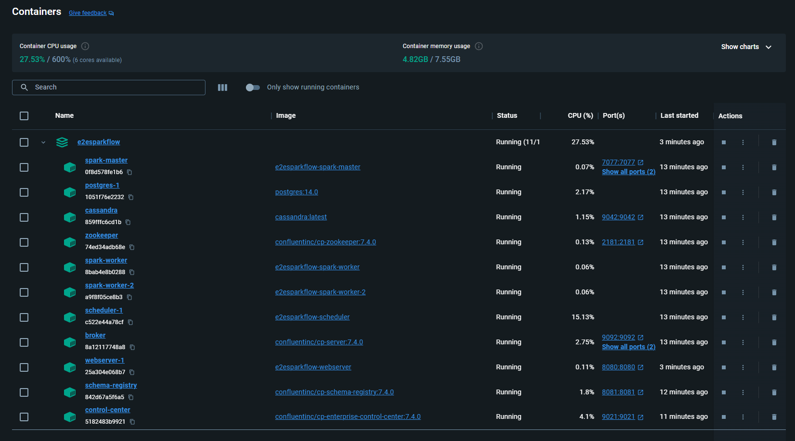
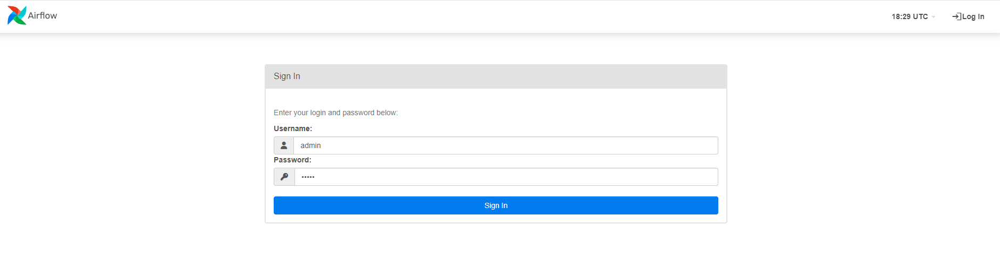
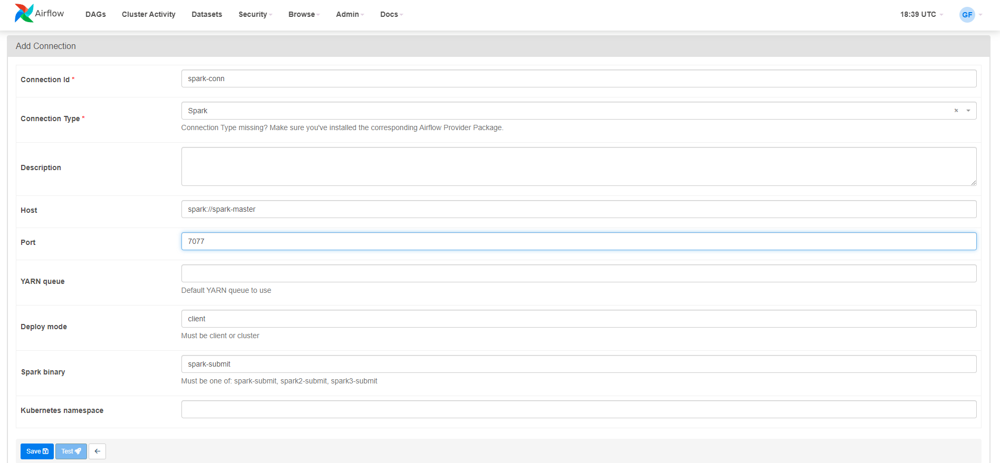
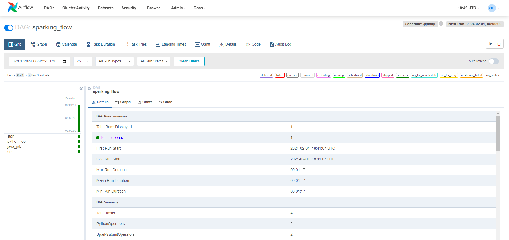
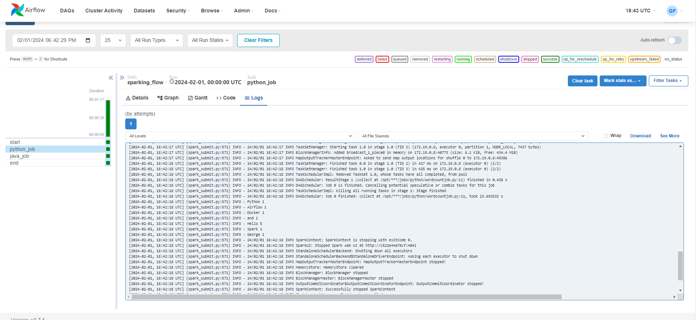
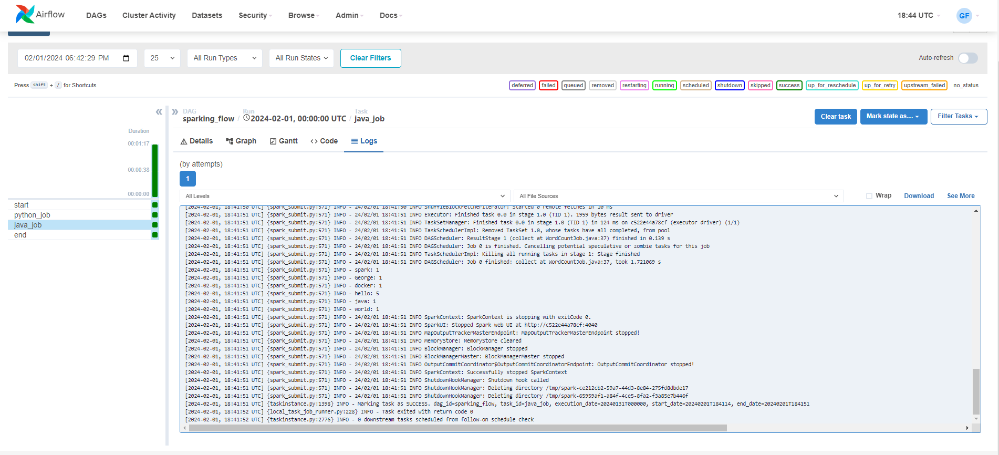
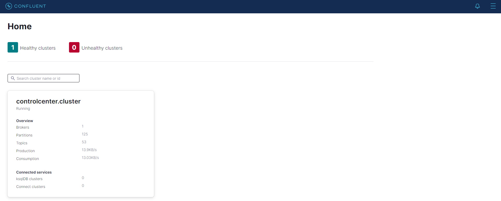
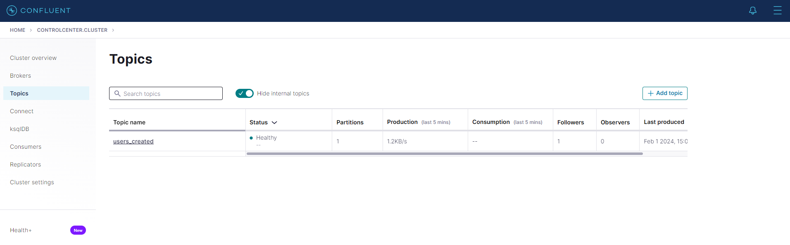
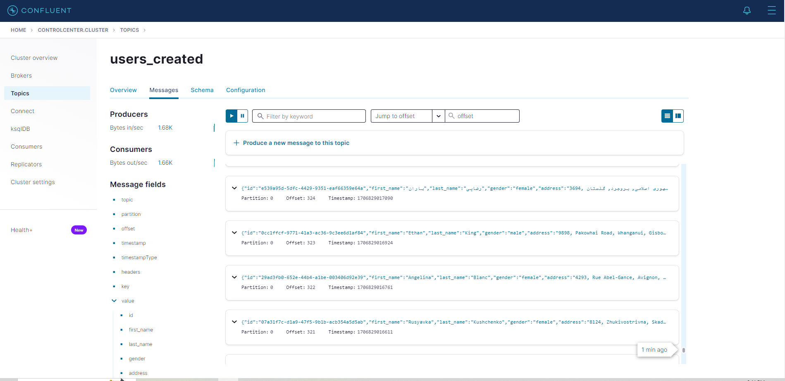

# E2E Spark Flow
This project handles data from start to finish using Docker, Apache Airflow, Kafka, Spark, Cassandra, and PostgreSQL. 
These tools work together to take in, handle, and keep data.

# System Architecture


# Technologies
1. **Apache Airflow**: An open-source platform used to programmatically author, schedule, and monitor workflows. Supports Python for workflow authoring.
2. **Apache Kafka**: An open-source distributed streaming platform for fault tolerance, high throughput, and a publish-subscribe messaging system.
3. **Apache Spark**: An open-source, powerful processing engine capable of handling intensive big data workloads. Its ability to perform batch processing, stream processing, and machine learning makes it an excellent tool for all data processing needs.
4. **Apache Cassandra**: An open-source NoSQL database, excellent for handling large amounts of write-heavy data. Its distributed design offers high availability without compromising fault tolerance, crucial for systems requiring uninterrupted operation.
5. **PostgreSQL**: An open-source relational database, in this case, focused on saving Airflow metadata.
6. **Docker**: An open-source containerization tool allowing isolated, consistent, and accessible deployment. Containers ensure consistency across multiple development, testing, and production environments, reducing the “it works on my machine” problem.
7. **Apache Zookeeper**: An open-source centralized service for maintaining configuration information, naming, and providing distributed synchronization. Essential for managing clustered services like Kafka.


---

# Starting the Project with Docker Compose

Docker Compose is a tool for defining and running multi-container Docker applications. For this project, It will orchestrate the containers for Apache Airflow, Kafka, Spark, Cassandra, PostgreSQL, and any other required services.

## Prerequisites

- Docker and Docker Compose installed on your system.

## Steps to Start the Project

1. **Clone the Project Repository (if not already done):**
   - Use Git to clone the project repository to your local machine.
   - Navigate to the root directory of the project.

2. **Configure Docker Compose:**
   - Ensure you have the `docker-compose.yml` file in your project directory. This file defines the configuration for each service (Airflow, Kafka, Spark, etc.).

3. **Building and Starting Containers:**
   - Open a Terminal/Command Prompt.
   - Navigate to your project directory.
   - Run the following command to build and start the containers as defined in your Docker Compose file:

     ```bash
     docker-compose up --build
     ```

   - This command builds the images for your services (if not already built) and starts the containers.

4. **Verify the Services:**
   - Once the containers run, you can verify that each service functions correctly.
   - You can access the web interfaces of services, like Apache Airflow, through your web browser.

5. **Stopping the Services:**
   - To stop and remove the containers, use the following command in the same directory:

     ```bash
     docker-compose down
     ```

   - This command stops all the running containers and removes them and their networks.

Certainly, let's format and improve the flow of the provided markdown:

---

Thank you for providing the API link. To incorporate it into the markdown, I'll update the reference under the "Data Ingestion" section. Here's the revised markdown with the API link included:

---

# Architecture Flow

## 1. Data Ingestion
- **Description**: Raw data, such as user data, is ingested into the system using Kafka.
- **Reference**: [Random User Data API](https://randomuser.me/api/).

## 2. Data Processing
- **Tools Used**: Airflow and Spark.
- **Process**: Airflow schedules Spark jobs to process the raw data. This includes data aggregation, filtration, and transformation according to specific business requirements.

## 3. Data Storage
- **Database Used**: Cassandra (a NoSQL database).
- **Functionality**: Ensures efficient handling and retrieval of large-scale data sets.

## Starting the Containers
After starting the containers, you can initiate Airflow by navigating to [http://localhost:8080/](http://localhost:8080/).

### Containers Running Successfully


## Accessing Airflow
- **Login Credentials**: Username `admin` and password `admin`.
- **Airflow Login Page**: 
- **Dashboard Overview**: After logging in, you will see the main page displaying two DAGs: `user_automation` and `sparking_flow`.
    - **Activating `user_automation` DAG**: Toggle the start button for `user_automation` and click on it to view DAG details. 
        

### Spark Connection Setup
To start the `sparking_flow` DAG, a Spark Connection is required.

1. **Navigation**: Go to Admin -> Connections in the Airflow UI.
2. **Adding Spark Connection**: 
    - **Connection ID**: `spark-conn`
    - **Connection Type**: `Spark`
    - **Host**: `spark://spark-master`
    - **Port**: `7077`
    - **Deploy Mode**: `client`
    - **Spark Binary**: `spark-submit`

    Configure as shown and click the `Save` button.
    

    After saving, the `spark-conn` connection should appear in the list.

### Sparking Flow DAG
Navigate back to the main page and start the `sparking_flow` DAG by toggling its button.



#### DAG Details:
- **Tasks**:
    - `start`: Prints "Jobs started" (PythonOperator).
    - `python_job`: Submits a Python Spark job (SparkSubmitOperator).
    - `java_job`: Submits a Java Spark job (SparkSubmitOperator).
    - `end`: Prints "Jobs completed successfully" (PythonOperator).
- **Execution**: The start task triggers the Spark jobs in parallel, followed by the end task upon their completion.

#### Job Logs
- **Python Job Log**: Click on the `python_job` task, then logs to view the job result.
    

- **Java Job Log**: Click on the `java_job` task, then logs to view the job result.
    

## Accessing Kafka Confluent Control Center
After using Airflow, you can access Kafka Confluent Control Center by navigating to [http://localhost:9021/](http://localhost:9021/).

### Kafka Confluent Control Center Main Page

- Click on `controlcenter.cluster` to access the Cluster Overview.

### Viewing Kafka Topics
- In the Cluster Overview, select `topics`. Here, you should find the `user_created` topic. If it is not visible, ensure the `user_automation` DAG is started in Airflow.
    

- Clicking on `user_created` will display the topic messages.
    

---