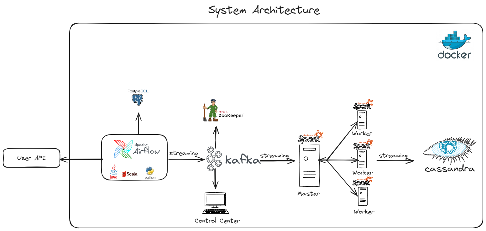

# E2E Spark Flow
This project handles data from start to finish using Docker, Apache Airflow, Kafka, Spark, Cassandra, and PostgreSQL. 
These tools work together to take in, handle, and keep data.

# System Architecture



# Technologies
1. **Apache Airflow**: A platform to programmatically author, schedule, and monitor workflows. It allows you to organize and manage tasks efficiently.
2. **Python**: A popular programming language known for its readability and versatility. It's widely used for web development, data analysis, artificial intelligence, and scientific computing.
3. **Apache Kafka**: A distributed streaming platform. It's used for building real-time data pipelines and streaming apps. It can handle high-throughput data feeds.
4. **Apache Zookeeper**: A centralized service for maintaining configuration information, naming, providing distributed synchronization, and providing group services. It's often used in distributed systems to manage their services.
5. **Apache Spark**: An open-source, distributed processing system used for big data workloads. It provides development APIs in Python, Java, Scala, and R, and an optimized engine that supports general computation graphs.
6. **Cassandra**: A distributed NoSQL database. It's designed to handle large amounts of data across many commodity servers, providing high availability with no single point of failure.
7. **PostgreSQL**: A powerful, open-source object-relational database system. It uses and extends the SQL language combined with many features that safely store and scale complicated data workloads.
8. **Docker**: A platform for developing, shipping, and running applications. It enables you to separate your applications from your infrastructure so you can deliver software quickly. Docker packages software into standardized units called containers that have everything the software needs to run including libraries, system tools, code, and runtime.

Certainly! Here's a README section that you can include in your project's documentation to guide users on how to install and start a Python virtual environment (venv):


# Setting Up a Python Virtual Environment

A Python virtual environment (venv) allows you to create isolated Python environments for your projects. This ensures that your project's dependencies do not interfere with the global Python installation and helps manage package dependencies efficiently.

Follow these steps to set up and activate a Python virtual environment for this project:

## Prerequisites

- [Python](https://www.python.org/downloads/) installed on your system.

## Installation

1. **Open a Terminal/Command Prompt:**

   - On Windows: Press `Win + R`, type `cmd`, and press Enter.
   - On macOS: Use the Terminal application.
   - On Linux: Use your preferred terminal emulator.

2. **Navigate to Your Project Directory:**

   Use the `cd` command to navigate to the directory where your project is located:

   ```bash
   cd /path/to/your/project
   ```

   Replace `/path/to/your/project` with the actual path to your project directory.

3. **Create a Python Virtual Environment:**

   Run the following command to create a virtual environment. Replace `venv_name` with the name you want to give to your virtual environment:

   ```bash
   python -m venv venv_name
   ```

   This will create a new directory named `venv_name` in your project directory.

## Activation

4. **Activate the Virtual Environment:**

   Depending on your operating system, use one of the following commands to activate the virtual environment:

   - On Windows:

     ```bash
     venv_name\Scripts\activate
     ```

   - On macOS and Linux:

     ```bash
     source venv_name/bin/activate
     ```

   After activation, you will see the virtual environment's name in your terminal prompt.

## Usage

5. **Install Dependencies:**

   With the virtual environment active, you can now install project-specific dependencies using `pip`. For example:

   ```bash
   pip install package_name
   ```

   This will install the package within the virtual environment, keeping your project isolated.

6. **Deactivation:**

   To deactivate the virtual environment and return to the global Python environment, use the following command:

   ```bash
   deactivate
   ```

   You will return to your system's default Python environment.

Certainly! To include the installation of project dependencies using `pip install -r requirements.txt` in the README section, you can modify the "Usage" section as follows:


## Usage

7. **Install Project Dependencies:**

   With the virtual environment active, you can install project-specific dependencies by running the following command:

   ```bash
   pip install -r requirements.txt
   ```

   This command will install all the dependencies listed in the `requirements.txt` file within the virtual environment, ensuring that your project has the necessary packages and versions.

